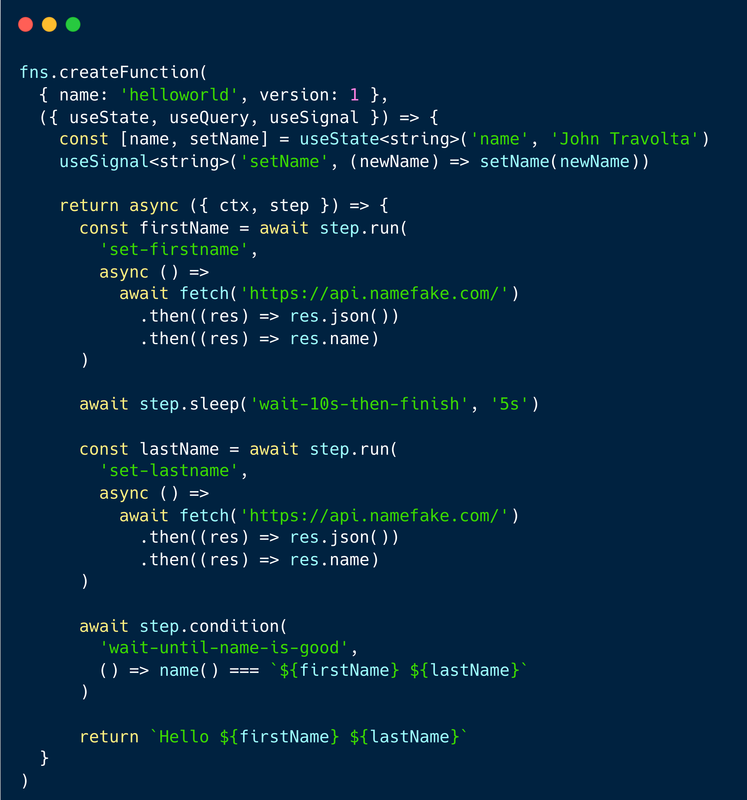

## About

<a href="https://www.fns.run">Website</a> -
<a href="https://discord.fns.run">Discord</a> -
<a href="https://docs.fns.run">Documentation</a>

> **⚠ Warning**  Fns is currently in the early stages of development and is
> not yet ready for daily use. Please do not use it in production environments.

**Fns SDK** is a serverless stateless durable function design pattern. Works
with any framework and platform.

## Key Features

- **Infinite Loop**: Run durable function for an infinite amount of time with
  auto snapshot.
- **Scalability**: Scale your durable function to infinity, the only limit is
  your provider.
- **Serverless**: No need to manage servers or infrastructure.
- **Signals & Queries**: Trigger signals or query to other functions.
- **Mutexes**: Solve race conditions at scale with intuitively.
- **Awaitable**: Await for the result of a function or signal.

## Core Philosophy

- **Deterministic**
- **Explicit**
- **Minimalistic**

## License

The Fns SDK and its integrations are licensed under the **Apache-2 License**.

The full text of the license can be accessed via
[this link](https://opensource.org/license/apache-2-0) and is also included in the
[LICENSE.md](LICENSE.md) file of this software package.
